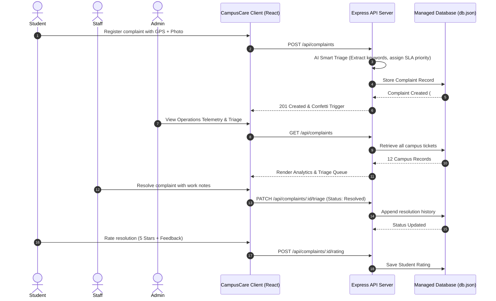

# 🎓 CAMPUSCARE — ACADEMIC PROJECT REPORT & SYSTEM SPECIFICATION

---

## 1. PROJECT IDENTIFICATION & METADATA

* **Project Title**: CampusCare — Automated Campus Facility Grievance & Service Level Management System
* **Domain**: Full-Stack Web Development, Campus Operations Automation, Natural Language Smart Triage
* **Academic Year**: 2026
* **Target Audience**: University Students, Facility Technicians, Department Heads, Campus Deans / Administrators

---

## 2. EXECUTIVE SUMMARY & ABSTRACT

Traditional campus maintenance and grievance reporting systems depend heavily on physical registers, fragmented WhatsApp/email messages, or unmonitored dropboxes. These legacy approaches result in prolonged service turnaround times, lost accountability during technician turnover, and student frustration.

**CampusCare** provides a unified, responsive, student-centric web platform built on a modern **Light Pink + White** glassmorphism aesthetic. It integrates:
1. **Multi-layer Geolocation & Mobile Reporting**: Students can register facility defects with automatic GPS positioning, building reverse-geocoding, and photo evidence.
2. **Natural Language Smart AI Triage**: Incoming complaints are categorized automatically, scored for urgency, and routed to the corresponding department.
3. **Atomic Staff Transfer Protocols**: Prevents lost grievances during staff departures by transferring active ticket queues to active successors with complete audit trails.
4. **Institutional Analytics & Multi-Format Reporting**: Telemetry dashboard providing Service Level Agreement (SLA) turnaround tracking and dual-format executive exports (Formatted Excel `.xls` spreadsheets & Executive printable PDF audit certificates).

---

## 3. SYSTEM REQUIREMENTS SPECIFICATION (SRS)

### 3.1 Hardware Requirements
* **Processor**: Dual-Core 2.0 GHz or higher (Intel Core i3/i5/i7 or AMD Ryzen/Apple Silicon)
* **RAM**: 4 GB minimum (8 GB recommended)
* **Storage**: 500 MB free hard drive space for repository, build bundles, and embedded database
* **Client Devices**: Responsive across Mobile (Android/iOS), Tablets, and Desktop/Laptop displays

### 3.2 Software & Technology Stack
* **Operating System**: Windows 10/11, macOS, or Linux
* **Client Framework**: React 18 with Vite build tool
* **Styling & UI**: Tailored CSS custom properties (`#EC4899`, `#FFF7FB`, `#FFFFFF`), Glassmorphism, CSS Grid/Flexbox
* **Runtime & Server**: Node.js (v18+) with Express.js REST API
* **Security & Auth**: JSON Web Tokens (JWT), bcryptjs hashing (10 salt rounds), Role Guards
* **Database Engine**: Persistent JSON Document Storage Engine (`backend/data/db.json`)
* **External APIs**: OpenStreetMap Nominatim Reverse Geocode API, BigDataCloud Geolocation API

---

## 4. SYSTEM ARCHITECTURE & DATA FLOW

---

## 5. DATABASE SCHEMA & DATA DICTIONARY

### 5.1 Users Collection (`users`)
| Field | Data Type | Constraints | Description |
| :--- | :--- | :--- | :--- |
| `id` | String | Primary Key, Unique | System user identifier (`usr_student_1`, `usr_staff_1`) |
| `name` | String | Required | Full name of student, staff, or administrator |
| `email` | String | Required, Unique, Indexed | Institutional email address |
| `passwordHash` | String | Required | bcrypt-hashed password (10 salt rounds) |
| `role` | String | Enum (`student`, `staff`, `admin`) | Clearance level for route guards |
| `studentId` | String | Optional (Students) | Roll number / University Registration Number |
| `department` | String | Optional | Academic or facility department affiliation |
| `status` | String | Optional (Staff) | Staff active status (`active`, `inactive`, `left_college`) |

### 5.2 Complaints Collection (`complaints`)
| Field | Data Type | Constraints | Description |
| :--- | :--- | :--- | :--- |
| `id` | String | Primary Key, Unique | Human-readable ticket ID (`CMP-2026-1081`) |
| `title` | String | Required | Brief summary of the facility grievance |
| `description` | String | Required | Detailed problem description |
| `category` | String | Required | Facility category (e.g., `wifi_it`, `electrical`, `civil`) |
| `priority` | String | Enum (`low`, `medium`, `high`, `urgent`) | Calculated or assigned urgency level |
| `status` | String | Enum (`Submitted`, `Under Review`, `Assigned`, `In Progress`, `Resolved`, `Closed`) | Lifecycle stage |
| `location` | String | Required | Composite building and room location string |
| `student` | Object | Embedded Object | Snapshot of reporting student profile |
| `assignedDepartment`| String | Foreign Key | Linked department identifier |
| `assignedStaff` | String | Foreign Key | Assigned technician ID |
| `statusHistory` | Array | Audit Log | Chronological transition records with author and timestamps |
| `rating` | Number | 1 to 5 Stars | Student satisfaction score |
| `resolutionNotes` | String | Min 10 chars for Resolved | Mandatory completion notes by technician |

---

## 6. KEY FUNCTIONAL MODULES

### Module 1: Student Grievance Lifecycle
* Self-registration and login with university roll ID.
* Multi-source location detection (Browser GPS &rarr; Network IP &rarr; Building dropdowns).
* Personal "My Tickets" workspace isolated from campus-wide backlogs.
* Interactive 5-star rating submission upon grievance closure.

### Module 2: Administrative Control & Dispatch
* Real-time KPI summary (Resolution Rate, Average SLA Turnaround, Active Backlog).
* Department and staff directory with real-time status indicators.
* Atomic technician replacement protocol with zero ticket loss.
* Comprehensive audit reports in Formatted Excel (`.xls`) and Executive PDF.

### Module 3: AI Smart Triage & Categorization
* Automated NLP signal extraction for category and department matching.
* Dynamic urgency scoring based on critical risk factors (exams, water leaks, power outages).

---

## 7. CONCLUSION & FUTURE ENHANCEMENTS

### Conclusion
**CampusCare** establishes a reliable, transparent, and aesthetically refined campus operations platform that bridges the communication gap between university students and facilities management teams. The solution eliminates ticket loss, guarantees SLA transparency, and provides actionable performance telemetry for university deans and administrators.

### Future Roadmap
1. **Push Notifications**: Integrating Web Push & SMS alerts for emergency outage announcements.
2. **IoT Sensor Integration**: Connecting automated energy/water flow meters to trigger tickets before students encounter breakdowns.
3. **Native Mobile App**: Packaging with React Native / Capacitor for mobile app store availability.
