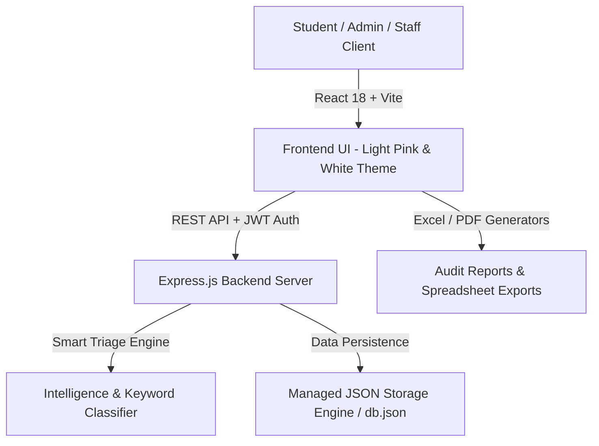

# 🌸 CampusCare — Smart College Complaint & Facility Management System

> A modern, full-stack campus facility management and grievance resolution platform designed with a premium **Light Pink + White** aesthetic, automated AI smart triage, real-time ticket timelines, staff reassignment workflows, and executive audit reports.

---

## 🌟 Key Highlights & Features

### 🎓 1. Student Portal
* **One-Click Complaint Submission**: Multi-category reporting (Wi-Fi/IT, Electrical, Civil/Furniture, Sanitation, Transport, Hostel, Canteen, Library, Academics).
* **Multi-Layer Geolocation**: High-accuracy browser GPS coordinates, reverse geocoding to human-readable building/corridor names, and manual room/floor selector.
* **Photo Attachments**: Upload and preview defect images.
* **My Tickets Dashboard**: Personal grievance status tracker with filtered category counts and timeline progress.
* **5-Star Rating & Feedback**: Rate resolution quality upon ticket closure.

### 🛡️ 2. Admin Command Center
* **Live SLA & Operations Telemetry**: Track overall campus resolution rate, average turnaround hours, active backlog, and student satisfaction.
* **Intelligent AI Triage Engine**: Auto-categorizes incoming problems, scores severity/urgency, and recommends the appropriate department and available technician.
* **Departments & Staff Roster**: Real-time staff status tracking (Active, Inactive, Left College).
* **Automated Staff Replacement & Ticket Transfer**: When a technician resigns or transitions roles, open complaints are atomically transferred to an active successor with full audit history.
* **Dual-Format Audit Reports**:
  * **Formatted Excel Spreadsheet (`.xls`)**: Status colors, categories, locations, and timestamps.
  * **Executive Printable PDF**: Institutional header, KPI cards, and Dean signature block.

### 🔧 3. Department Staff Console
* **Assigned Work Queue**: Filter tickets assigned to specific technicians or departments.
* **Resolution Notes & Evidence Upload**: Mandatory detailed resolution notes before marking tickets as Resolved.
* **Public/Internal Timeline Discussion**: Coordinate with students and supervisors.

---

## 🏗️ System Architecture & Tech Stack



### 💻 Technology Stack

| Layer | Technologies Used |
| :--- | :--- |
| **Frontend UI** | React 18, Vite, React Router 7, Lucide Icons, Canvas Confetti |
| **Styling & Design** | Vanilla CSS Design System (`#EC4899`, `#FFF7FB`, `#FFFFFF`, Glassmorphism) |
| **Backend Server** | Node.js, Express 4, RESTful Architecture, CORS |
| **Authentication & Security** | JWT (JSON Web Tokens), bcryptjs password hashing, Role-based route guards |
| **Database** | Persistent JSON Document Database Engine (`backend/data/db.json`) |
| **Geolocation** | OpenStreetMap Nominatim, BigDataCloud, Browser Geolocation API |

---

## 🚀 Quick Start Guide (Run Locally)

### Prerequisites
* [Node.js](https://nodejs.org/) (v18 or newer)
* npm (v9 or newer)

### 1. Clone or Open Project
```bash
cd "project folder"
```

### 2. Install Dependencies
```bash
# Install frontend dependencies
npm install

# Install backend dependencies
cd backend
npm install
cd ..
```

### 3. Start Backend Server
```bash
cd backend
npm run dev
```
*Backend will start at: `http://localhost:5000`*

### 4. Start Frontend Dev Server
In a new terminal:
```bash
npm run dev
```
*Frontend will open at: `http://localhost:5173`*

---

## 🔑 Demo Login Accounts

| Role | Email / Roll ID | Password | Access Rights |
| :--- | :--- | :--- | :--- |
| **Dean / Administrator** | `admin@college.edu` | `admin123` | Full Campus Administration, Staff Replacement, Analytics & AI Intelligence |
| **IT Lead (Staff)** | `alex.chen@college.edu` | `staff123` | Department Triage, Complaint Resolution & Live Status Updates |
| **Student (Priya Sharma)** | `STU-2024-8841` or `priya.sharma@college.edu` | `student123` | Raise Complaints, Track My Tickets, Provide Ratings |

---

## 🌐 Cloud Deployment (Free)

### Deploy Backend to Render
1. Create a **Web Service** on [Render.com](https://render.com).
2. Connect your repository, set **Root Directory** to `backend`, **Build Command** to `npm install`, and **Start Command** to `npm start`.
3. Add Environment Variables: `PORT=5000`, `JWT_SECRET=campuscare_super_secret_jwt_key_2026_secure`.

### Deploy Frontend to Netlify or Vercel
1. Import repository on [Netlify.com](https://netlify.com) or [Vercel.com](https://vercel.com).
2. Build Command: `npm run build`, Output Directory: `dist`.
3. Set Environment Variable: `VITE_API_URL=https://your-render-backend.onrender.com/api`.

---

## 📂 Project Structure

```
project folder/
├── backend/
│   ├── data/
│   │   └── db.json                   # Database records (Users, Complaints, Departments)
│   ├── src/
│   │   ├── controllers/              # Auth, Complaints, Departments, Analytics controllers
│   │   ├── db/                       # Storage engine & self-seeding
│   │   ├── middleware/               # JWT authentication & role-based access control
│   │   ├── services/                 # AI Complaint Intelligence & Classifier
│   │   └── server.js                 # Express server entrypoint
│   └── package.json
├── src/
│   ├── api/                          # Dynamic REST API client
│   ├── components/
│   │   ├── admin/                    # Admin Dashboard, Departments, Analytics, Triage
│   │   ├── auth/                     # ProtectedRoute & Role Guards
│   │   ├── common/                   # Modal, Badges, Toast, ErrorBoundary, StatCard
│   │   ├── complaints/               # ComplaintList, ComplaintCard, DetailPage
│   │   ├── intelligence/             # AI Analytics, Heatmap & Pattern Detector
│   │   ├── layout/                   # Header, Sidebar (Pink & White theme)
│   │   ├── pages/                    # LandingPage, DashboardPage, NotFoundPage
│   │   ├── shared/                   # ExportModal (Excel .xls & Executive PDF)
│   │   └── student/                  # StudentLoginPage, ComplaintSubmissionPage, StudentDashboard
│   ├── context/                      # AuthContext, AppContext
│   ├── data/                         # Categories, Departments seed data
│   ├── utils/                        # GPS & Reverse Geocoding utilities
│   ├── App.jsx                       # Main application router
│   └── index.css                     # Pink & White design system variables & styles
├── netlify.toml                      # Netlify SPA routing configuration
├── vercel.json                       # Vercel SPA routing configuration
├── render.yaml                       # Render deployment blueprint
├── package.json
└── README.md
```

---

## 📜 License
Developed for Academic Capstone / University Project. All rights reserved.
